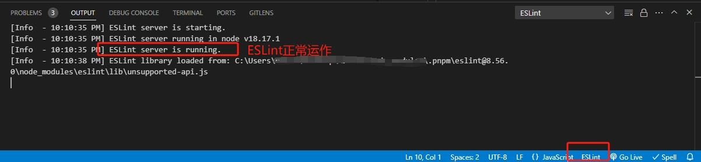

# 我的 linter 工具集合

虽然目前 ESLint 有 auto-fix 功能，但例如 max-len 等规则仍然无法支持 auto-fix，Prettier 还是需要和 ESLint 配合使用才更香。这样一来，配置文件太多太杂太乱，还需要关注很多和项目本身无关的依赖。

于是有了这个仓库，用于整合各种 lint 相关配置、依赖。

## 🚀Features
目前整合了以下规则：
- eslint-recommended
- [@typescript-eslint/eslint-plugin](@typescript-eslint/eslint-plugin)
- [eslint-config-prettier](https://github.com/prettier/eslint-config-prettier)（用来禁用 ESLint 和 Prettier 的冲突规则的）


## 📦Install

> ⚠ 使用时**需要**安装 ESLint@8.0.0+ 和 Prettier

```
npm install @heteng99/linter eslint prettier -D
```

## ☕How to use it

### 生成配置文件

使用 `lint-cli` 生成模板配置文件

```bash
npm run lint-cli
```

执行命令后，执行目录下会生成两个配置文件 `eslint.config.js` 和 `prettier.config.js`

### VSCode 相关修改

如果你使用的是 VSCode 并且 ESLint 看起来没有起作用，可能还需要做以下工作：

#### Ⅰ. 安装插件

- 插件：ESLint，作者：Microsoft
- 插件：Prettier，作者：Prettier

#### Ⅱ. 修改配置

在 settings.json 中添加[这些配置](./readme_resources/settings.json)

#### Ⅲ. 查看 OUTPUT

查看控制台的输出，如图表示 ESLint 正常运作，可以做其他事情啦~


### 修改规则、配置

#### Ⅰ. 覆盖 Prettier 规则

修改 `prettier.config.js` 文件，详情见 [Prettier 配置参考](https://prettier.io/docs/en/options.html)

```js
/** @type {import("prettier").Config} */
export default {
  // add prettier rules here
};
```

#### Ⅱ. 覆盖 ESLint 规则

修改 `eslint.config.js` 了，例如我想要：

- 添加一条规则
- 添加 ignore 规则

```js
// eslint.config.js
import eslintPluginPrettierRecommended from 'eslint-plugin-prettier/recommended';
import { defineFlatConfig } from 'eslint-define-config';

export default defineFlatConfig([
  eslintPluginPrettierRecommended,
  {
    rules: {
      'max-len': 120,
    },
    ignore: ['dist/**/*.js'],
  },
]);
```

可参考：

- [ESLint Flat 配置](https://eslint.org/docs/latest/use/configure/configuration-files-new)
- [ESLint Rules](https://eslint.org/docs/latest/rules/)

## ☑️TODO

- 添加规则 [eslint-plugin-vue](https://github.com/vuejs/eslint-plugin-vue)
- 添加规则 [eslint-plugin-react](https://github.com/jsx-eslint/eslint-plugin-react) 
- 支持内置 StyleLint
- ✔️ 改造成 lint-cli，运行命令完成所有配置

## 📖推荐阅读

- [eslint为什么没有实现max-len的autofix？](https://juejin.cn/post/7108201700925636644)
- [ESLint 之与 Prettier 配合使用](https://juejin.cn/post/6924568874700505102)
- [prefer-arrow-callback fix conflicting with prettier fix #65](https://github.com/prettier/eslint-plugin-prettier/issues/65)
